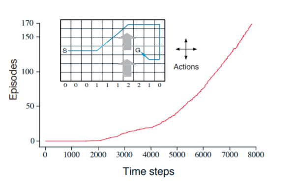
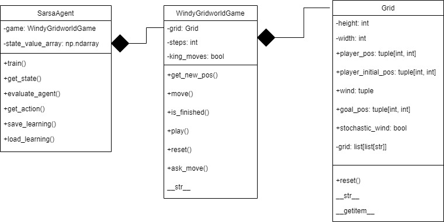

From _Reinforcement Learning: An introduction_ of Richard S. Button and Andrew G. Barto:

Shown inset below is a standard gridworld, with
start and goal states, but with one difference: there is a crosswind running upward
through the middle of the grid. The actions are the standard four—up, down, right,
and left—but in the middle region the resultant next states are shifted upward by a
“wind,” the strength of which varies from column to column. The strength of the wind
is given below each column, in number of cells shifted upward. For example, if you are one cell to the
right of the goal, then the action left takes you to the cell just above
the goal. This is an undiscounted episodic task, with constant rewards
of 1 until the goal state is reached. The graph to the right shows the
results of applying epsilon-greedy Sarsa to this task, with epsilon = 0.1, alpha = 0.5, and the initial values Q(s, a)=0
for all s, a. The increasing slope of the graph shows that the goal was
reached more quickly over time. The increasing slope of the graph shows that the goal was
reached more quickly over time. By 8000 time steps, the greedy policy was long since optimal (a trajectory from it is 
shown inset); continued epsilon-greedy exploration kept the average episode length at about 17 steps,
two more than the minimum of 15. Note that Monte Carlo methods cannot easily be used
here because termination is not guaranteed for all policies. If a policy was ever found
that caused the agent to stay in the same state, then the next episode would never end.
Online learning methods such as Sarsa do not have this problem because they quickly
learn during the episode that such policies are poor, and switch to something else.

**Exercise 6.9**: Windy Gridworld with King’s Moves (programming) Re-solve the windy
gridworld assuming eight possible actions, including the diagonal moves, rather than the
usual four. How much better can you do with the extra actions? Can you do even better
by including a ninth action that causes no movement at all other than that caused by
the wind?

**Exercise 6.10**: Stochastic Wind (programming) Re-solve the windy gridworld task with
King’s moves, assuming that the effect of the wind, if there is any, is stochastic, sometimes
varying by 1 from the mean values given for each column. That is, a third of the time
you move exactly according to these values, as in the previous exercise, but also a third
of the time you move one cell above that, and another third of the time you move one
cell below that. For example, if you are one cell to the right of the goal, and you move
left, then one-third of the time you move one cell above the goal, one-third of the time
you move two cells above the goal, and one-third of the time you move to the goal.

### My implementation
